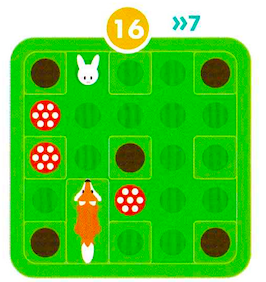

# COMP1110 Assignment 1

## Academic Honesty and Integrity

Honesty and integrity are of utmost importance. These goals are *not* at odds
with being resourceful and working collaboratively. You *should* be resourceful
and you may discuss the assignment
and other aspects of the course with others taking the class. However, the golden
rule is simple: **you must never misrepresent the work of others as your own**.

If you have taken ideas from
elsewhere or used code sourced from elsewhere, you must say so with *utmost
clarity*. At each stage of the assignment you will be asked to submit a statement
of originality, either as a group or as individuals. This statement is the place
for you to declare which ideas or code contained in your submission were sourced
from elsewhere.

Please read the ANU's [official position](http://academichonesty.anu.edu.au/) on
academic honesty. If you have any questions, please ask me.

Carefully review the [statement of originality](originality.yml) which you must
complete.  Edit that statement and update it as you complete the assignment,
ensuring that when you complete the assignment, a truthful statement is
committed and pushed to your repo.

## Purpose

This assignment is introductory, helping you gain familiarity with the basics
of Java, but doing so in the context of slightly larger piece of code.  Most of
the assignment is composed of a series of small tasks.

## Assignment Deliverable

The assignment is worth 5% of your total assessment, and it will be marked out
of 5. However, these marks are [redeemable](https://cs.anu.edu.au/courses/comp1110/assessments/redeemable/) by the exam,
so if your exam mark / 20 is higher than your assignment one mark, you will get the exam mark / 20 rather
than the assignment one mark. **The mark breakdown is described on the
[deliverables](https://cs.anu.edu.au/courses/comp1110/assessments/deliverables/#D1A) page.**

The assignment is due at **17:00 Monday Week 4**, **14th March**, giving you **2** weeks in which to complete it.  You can find [this deadline](https://cs.anu.edu.au/courses/comp1110/assessments/deliverables/#D1A)
on the [deliverables page](https://cs.anu.edu.au/courses/comp1110/assessments/deliverables/), where all assignment deadlines for this semester are
listed.
Your tutor will mark your assignment by accessing your GitLab repository, so it is essential that you carefully follow
instructions for setting up and maintaining your repository. You will be marked
according to **whatever is committed to your repository at the time of the deadline**.
Since the first assignment is redeemable, [**late extensions
are not offered and will not be given**](https://comp.anu.edu.au/courses/comp1110/policies/#deadlines). As always, throughout the course, if
some significant circumstance arises outside of the course that affects your capacity to complete the course, please
carefully follow the ANU's [special consideration process](http://www.anu.edu.au/students/program-administration/assessments-exams/special-assessment-consideration), and your circumstances will be accounted for in your final
assessment.

## Overview

The assignment is based on a simple children's puzzle called [Jumpin'](https://www.smartgames.eu/uk/one-player-games/jumpin),
made by [SmartGames](http://www.smartgames.eu/), a producer of educational games. The design at the end of the game and 
all of the imagery in this assignment comes from their JUMPIN' game.

The aim of the game is to help the rabbits jump to safety inside their rabbit holes!

## Pieces

The game consists of mushrooms, foxes and rabbits, which all define the challenge of the game. 

Mushrooms and rabbits each take up one space on the board, whereas foxes each take up two spaces on the board. Each
piece moves by its own rules:

* Mushrooms are stationary and cannot be moved.
* Foxes move by sliding forward or backward. They cannot jump over obstacles or be placed elsewhere on the board.
* Rabbits move by jumping horizontally or vertically over one or more spaces with obstacles. There is more detail about
rabbit movement in the [rabbit movement](#rabbit-movement) section of this document.

## Objective

The objective of the game is to move all rabbits in the given challenge into one of five rabbit holes on the board,
following the rules of the game.

Each challenge defines the initial positions of mushrooms, foxes and rabbits.

A sample challenge from the challenge booklet is shown here:

* The rabbit image denotes the position of the rabbit
* The fox image denotes the two positions occupied by the fox
* The red circles with white circles inside them denote the positions of the mushrooms
* The brown circles denote the positions of the brown rabbit holes. These positions are always the same.
* The number 'sixteen' inside the yellow circle denotes the challenge number (in this case, it is sixteen).
* The two blue arrows and blue 'seven' denote the minimum number of moves required to solve the challenge (in this
challenge, it is seven).

Note that only the orientation of the foxes is relevant to the game. The orientation of rabbits and mushrooms is
irrelevant.

The game is successfully completed once every rabbit is inside one of five rabbit holes. See the [rules](#rules) below.

The game comes with 60 pre-defined challenges, organised into five difficulty levels from *starter* to *wizard*. Each
time the game is played, the challenge may be different. Some challenges are easier to solve than others. The game is
designed so that a player may specify the difficulty level. In the real game there are five difficulty levels, each with
12 different possible challenges. In our version, the user may select the level of difficulty on a slider.

We have provided you with a [paper version of the game](assets/papergame.pdf),
which you can print out and use to help you visualise the game if you wish.

## Rules

To complete the challenge, each rabbit must be inside one of five brown rabbit holes on the board. These holes are
always the same for every challenge, and can be seen in the [objective](#objective) section.

### Rabbit Movement

As mentioned in the [pieces](#pieces) section of this document, rabbits move by jumping horizontally or vertically over
one or more spaces with obstacles. In more detail:

* Rabbits must land on the first empty space after a jump - they can never move over empty spaces.
* Rabbits can never move without jumping over at least one obstacle, thus they can never move to an adjacent space.
* A rabbit hole with a rabbit inside is an obstacle, while empty rabbit holes are not obstacles.
* A rabbit can jump into - but not over - an empty rabbit hole.
* If needed, rabbits can jump out of rabbit holes they are already sitting in.
* Rabbits can jump over a fox no matter the orientation of the fox: tail to front, front to tail, or over the side.

Importantly, this means that a rabbit can only move to at most one position in
each cardinal direction. Whether it can move in a certain direction depends on
whether the rabbit has a neighbouring rabbit, fox or mushroom in that
direction, and whether there is an empty position on the board in that
direction.

Below are some diagrams to illustrate possible moves in certain challenges:

### Solutions

Each challenge has only one final state. There may be several shortest *solutions*, that is, sequences of rabbit and fox
actions, to obtain this final state. For example, one way of solving the challenge provided in the [objective](#objective) 
section of this document is

which denotes:

1. Moving the north-facing fox forward two spaces so that its head is at position (1,1);
2. Moving the cream rabbit over the north-facing fox and then over the mushroom furthest down on the board (at position (2,3)) so that the
   cream rabbit is at position (3,3);
3. Moving the north-facing fox backward one space so that its head is at position (1,2); and finally
4. Moving the cream rabbit over the mushroom at (2,3) and over the north-facing fox's tail so that the cream rabbit is at position (0,3), then
   moving the cream rabbit over the two left-most mushrooms so that it is in the top-left hand rabbit hole at position (0,0).

## Encoding the Game

### Positions

In our game we encode `positions` on the board as a string of two numbers between 0 and 4, representing the `x` and `y`
coordinates of the position. For example, the string `"04"` corresponds to the position `(0,4)`. Positions correspond
to board positions as follows:

There is also a `Position` class that stores this information as well as some useful methods that you will
implement in this assignment.

More information can be found in the `Position` [class](src/comp1110/ass1/Position.java).

It is also useful (for storing the game state) to encode these positions as indices,
that is an integer from 0-24 corresponding to a position as follows:

|     | **0** | **1** | **2** | **3** | **4** |
|-----|-------|-------|-------|-------|-------|
|**0**| 0     | 1     | 2     | 3     | 4     |
|**1**| 5     | 6     | 7     | 8     | 9     |
|**2**| 10    | 11    | 12    | 13    | 14    |
|**3**| 15    | 16    | 17    | 18    | 19    |
|**4**| 20    | 21    | 22    | 23    | 24    |

For example, the position `(2,1)` may be represented as index `7` and vice-versa.

### Challenge Encoding

The initial state of the game is encoded as a string that represents the positions of the rabbits, mushrooms and
foxes.

The type of piece is indicated by `'C'` (cream rabbit), `'B'` (brown rabbit), `'G'` (gray rabbit), `'M'` (mushroom) and
`'F'` (fox). This letter is then followed by a list of position encodings denoting all positions that pieces of this
type occupy. 

Notice that foxes occupy two positions each on the board. As a result, they are
encoded slightly differently. Each position that follows the letter `'F'` in
the encoding is the position of a fox's head (see the diagram below for a
visual representation of this). Each position is preceded by one of the letters
`'N'`, `'S'`, `'E'` or `'W'`. This is the direction in which the fox faces.
From this information, the other location occupied a given fox, that is its
tail, can be deduced. In general, a fox string will be encoded as follows:

`F{N|S|E|W}{0-4}{0-4}`

where `|` denotes a choice between any of the options in the curly braces and
`-` denotes a range (in this case, between 0 and 4 inclusive).

If the list is empty for a type of piece, then the letter is not included. In 
general the encoding takes the following form:

`C{cream rabbit position}B{brown rabbit position}G{gray rabbit position}M{mushroom positions}F{fox directions/positions}`

Note that the order of the letters is important.

For example, the string `"C03M410242FN10S31"` defines the following board state:

Exhaustively, this initial state means:

* `"C03"`: the cream rabbit is located at the position `(0,3)`.
* The absence of `"B"` and `"G"` clauses means that the brown and gray rabbits are not in this challenge.
* `"M410242"`: there are three mushrooms, located at `(4,1)`, `(0,2)` and `(4,2)`.
* `"FN10S31"`: there are two foxes. One fox faces north, and its head is
  located at position `(1,0)`. Note that from this information we can deduce
  that its tail is located at position `(1,1)`. The other fox is facing south,
  and its head is located at `(3,1)`. Again, from this information we can
  deduce that its tail is located at position `(3,0)`.

The `Challenge` [class](src/comp1110/ass1/Challenge.java) has all 60 of the challenge instances encoded for you already.

### Animal Movement Encoding

An individual animal movement is encoded by a two- or three-character string.

If the moving animal is a rabbit, then the encoding is two characters, that is the rabbit's colour and the direction in
which it is moving. For example, in the example challenge in the [challenge encoding](#challenge-encoding) section, the
string `"CN"` would denote the cream rabbit hopping north over the mushroom located at `(0,2)`.

If the moving animal is a fox, then the encoding is three characters, with the first character being `"F"` to encode it
is a fox, the second character encoding the direction in which the fox faces, and the third character denoting the
cardinal direction in which the fox is moving. For example, in the example challenge in the
[challenge encoding](#challenge-encoding) section, the string `"FNS"` would denote the north-facing fox, on the
left-hand side of the board, moving south by one cell. Similarly, the string `"FSS"` would denote the south-facing fox,
on the right-hand side of the board, moving south by one cell. Note that north- and south-facing foxes cannot move east
or west, and east- and west-facing foxes cannot move north or south.

Note that, strictly, foxes move one cell at a time. However, moving forwards or
backwards several cells can be achieved by moving forwards or backwards one
cell multiple times.

You may find it helpful to use the [paper version of the game](assets/papergame.pdf) to think
through these examples correctly.

### Solution Encoding

An encoding of the solution to a challenge is a combination of individual animal movements representing an order of
animal movements that solve the given challenge.

For example, a solution to the example challenge in the [challenge encoding](#challenge-encoding) section has the
encoding `"FNSFNSFSSFSSCECECN"`, which corresponds to the below solution:

Finally, note that a partial solution is encoded similarly to a solution, that is, it is a concatenation of individual
animal movements. Furthermore, for most challenges there are multiple valid shortest solutions. Any valid shortest
solution to a given challenge is considered to solve that challenge.

For example, `"FNSFNSCEFSSFSSCECN"` is another valid solution to the above challenge.

Note that there is a `board` field in the `Jumpin` class that allows you to access the index (and hence, position) of 
each rabbit, fox and mushroom in the game.

### Your Task

Unfortunately your version of the assignment has some missing code.
While the graphical user interface is complete, some of the important
logic is missing, so it won't work as described above.  It is your job
to fix the problems, each identified by a FIXME comment in the
source code, so that the code works.  Do not change the code except by
following each of the assigned tasks.  When those tasks are completed,
the game will function correctly.  Check your changes by using the
provided unit tests.

## Legal and Ethical Issues

First, as with any work you do, you must abide by the principles of
[honesty and integrity](https://comp.anu.edu.au/courses/comp1110/policies/#academic-integrity).
I expect you to demonstrate honesty and integrity in everything you do.

In addition to those ground rules, you are to follow the rules one
would normally be subject to in a commercial setting. In particular,
you may make use of the works of others under two fundamental
conditions: a) your use of their work must be clearly acknowledged,
and b) your use of their work must be legal (for example, consistent
with any copyright and licensing that applies to the given material).
**Please understand that violation of these rules is a very serious
offence**. However, as long as you abide by these rules, you are
explicitly invited to conduct research and make use of a variety of
sources. You are also given an explicit means with which to declare
your use of other sources (via originality statements you must
complete). It is important to realize that you will be assessed on the
basis of your original contributions to the project. While you won't
be penalized for correctly attributed use of others' ideas, the work
of others will not be considered as part of your
contribution. Therefore, these rules allow you to copy another
student's work entirely if: a) they gave you permission to do so, and
b) you acknowledged that you had done so. Notice, however, that if you
were to do this you would have no original contribution and so would
receive no marks for the assignment (but you would not have broken any
rules either).

## Evaluation Criteria

**The mark breakdown is described on the
[deliverables](https://cs.anu.edu.au/courses/comp1110/assessments/deliverables/#D1A) page.**

The follow task numbers are associated with specific gitlab issues.

**Pass**
* Tasks #1, #2, #3, #4, #5, #6

**Credit**
* Tasks #7, #8, #9 *(in addition to all tasks required for Pass)*

**Distinction**
* Tasks #10, #11 *(in addition to all tasks required for Credit)*

**High Distinction**
* Tasks #12 *(in addition to all tasks required for Distinction)*

**IMPORTANT NOTE:** *It is very important that you understand that you are*
**not** *required to complete all elements of the assignment. In fact, **you
are not encouraged to pursue the Distinction and High Distinction tasks unless
you feel motivated and able to do so**. Recall that the assignment is
redeemable against the exam. The last part of the assignment are significantly
harder than the others, but is worth only one additional mark. I don't
encourage you to spend too much time on this unless you are enjoying the
challenge of solving these harder problems. Solutions to task #12 involve
ideas that I have **not covered**, or not covered deeply in class; you may need
to go beyond the course material.*
